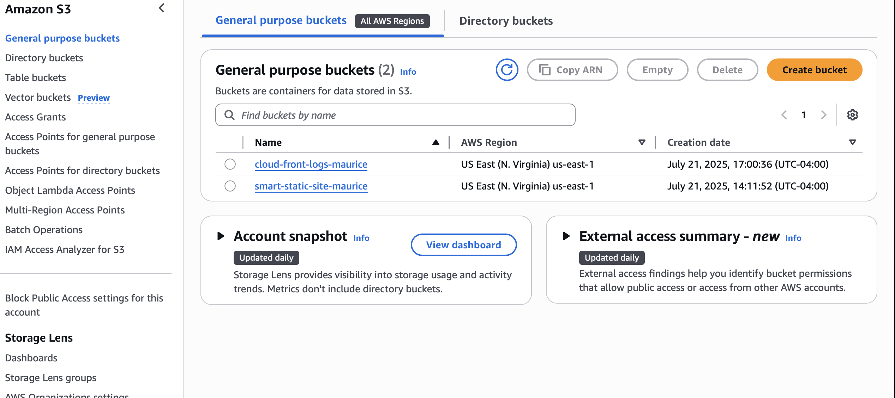

# ☁️ Smart Static Site – AWS Cloud Microservices Project

> Hosted by: Maurice Colon  
> GitHub: [mjcolon218](https://github.com/mjcolon218)  
> 🔒 Fully automated CI/CD + CDN + HTTPS + Logging with AWS

---

## 📌 Overview

The **Smart Static Site** is a lightweight cloud-native project that simulates how companies deliver secure, global web content using AWS microservices. It’s designed to demonstrate foundational AWS services aligned with the **Cloud Practitioner Certification** and real-world consulting workflows.

---

## 🧩 Microservices Architecture

| AWS Service | Role in Architecture | Description |
|-------------|----------------------|-------------|
| 🪣 Amazon S3 | Static Site Storage | Hosts `index.html`, `error.html`, and all static web assets. |
| 🌍 Amazon CloudFront | CDN Edge Distribution | Distributes your site with low-latency global access and HTTPS. |
| 🔐 AWS Certificate Manager | TLS Encryption | Provides a free SSL certificate for secure access. |
| 🚀 GitHub Actions | CI/CD Automation | Deploys website files to S3 and invalidates CloudFront cache. |
| 🌐 Route 53 (optional) | Domain DNS Routing | Routes traffic via a custom domain. |
| 📦 CloudFront Logging + S3 | Observability | Stores visitor logs for audit, analysis, and debugging. |
| 👤 IAM | Access Control | Manages secure credentials and permissions for CI/CD. |

---

## 🛠️ Setup Instructions

### ✅ Prerequisites

- AWS Account (with billing enabled)
- IAM User with S3, CloudFront, and Certificate Manager permissions
- GitHub repository with GitHub Actions enabled
- [AWS CLI](https://docs.aws.amazon.com/cli/latest/userguide/install-cliv2.html) installed and configured

---

## 🚀 Deployment Steps (No Domain Option)

### 🔹 Step 1: Create S3 Bucket

```bash
aws s3 mb s3://smart-static-site-maurice --region us-east-1
```
Enable static hosting, upload `index.html` and `error.html`.

---

### 🔹 Step 2: Setup CloudFront Distribution

- Set **Origin Type**: Website endpoint  
- Restrict bucket access: ❌ No  
- Enable HTTPS: ✅ Yes  
- Enable Logging: Point to `cloud-front-logs-maurice` bucket

---

### 🔹 Step 3: Configure HTTPS with ACM

Use AWS Certificate Manager to:
- Request a public certificate for your domain (optional)
- Or use default CloudFront SSL for `*.cloudfront.net`

---

### 🔹 Step 4: CI/CD with GitHub Actions

Create `.github/workflows/deploy.yaml`:

```yaml
name: Deploy to S3

on:
  push:
    branches:
      - main

jobs:
  deploy:
    runs-on: ubuntu-latest
    steps:
    - uses: actions/checkout@v3
    - uses: aws-actions/configure-aws-credentials@v4
      with:
        aws-access-key-id: ${{ secrets.AWS_ACCESS_KEY_ID }}
        aws-secret-access-key: ${{ secrets.AWS_SECRET_ACCESS_KEY }}
        aws-region: us-east-1
    - run: aws s3 sync . s3://smart-static-site-maurice --delete
    - run: aws cloudfront create-invalidation --distribution-id ${{ secrets.DISTRIBUTION_ID }} --paths "/*"
```

➡️ Add your AWS keys and distribution ID to repo **Secrets**:
- `AWS_ACCESS_KEY_ID`
- `AWS_SECRET_ACCESS_KEY`
- `DISTRIBUTION_ID`

✅ CI/CD success snapshot is documented in project screenshots.

---

## 🔐 IAM and Access Policy Setup

Use this policy for the IAM user:

```json
{
  "Version": "2012-10-17",
  "Statement": [
    {
      "Effect": "Allow",
      "Action": [
        "s3:*",
        "cloudfront:CreateInvalidation",
        "cloudfront:Get*",
        "cloudfront:List*"
      ],
      "Resource": "*"
    }
  ]
}
```

---

## 📝 Logging and Monitoring

- Enable CloudFront logging
- Target logs to: `cloud-front-logs-maurice`

Use [Amazon Athena](https://docs.aws.amazon.com/athena/latest/ug/cloudfront-logs.html) to query log files.

---

## ✅ How to Test Deployment

1. Go to your CloudFront URL: `https://d123abc123.cloudfront.net`
2. See the page? ✅
3. Update `index.html`, push → check GitHub Actions runs again
4. Logs should appear in logging S3 bucket

---

## 📸 Visual References

| Screenshot | Description |
|------------|-------------|
|  | GitHub Actions successfully deployed |
|  | S3 logging bucket setup |
|  | IAM with roles and user |
|  | Webpage
 |

---

## 📦 What You Learn (Mapped to AWS Cloud Practitioner)

| Skill | Certification Area |
|-------|---------------------|
| S3 Website Hosting | AWS Core Services |
| IAM Permissions | Security & IAM |
| CloudFront & ACM | Global Infrastructure & Networking |
| GitHub CI/CD | DevOps & Cloud Deployment |
| Logging Setup | Cloud Monitoring & Cost Management |

---

## 💼 Real-World Use Cases

This same architecture can be offered to:
- Marketing agencies needing static site deployment
- Data teams hosting visual dashboards
- Educators publishing course content securely
- Freelancers needing low-cost hosting with global CDN

---

## 📚 Next Steps

- Add a custom domain with Route 53
- Monitor performance via CloudWatch
- Use S3 Lifecycle Policies for storage cost savings

---

## 🧠 Author

**Maurice J. Colon**  
Data & Cloud Analytics Consultant  
📍 Bronx, NY  
🔗 [GitHub Profile](https://github.com/mjcolon218)

---
